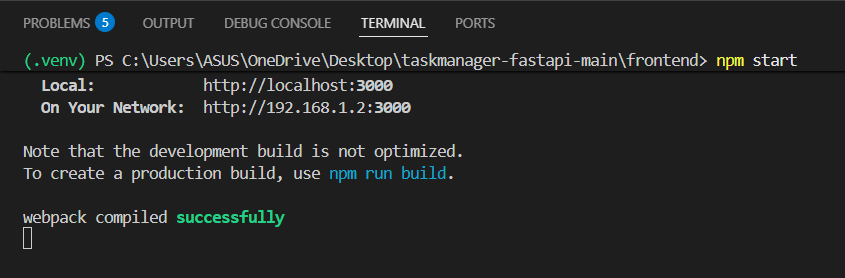

# Task Manager (FastAPI + React)

A full-stack Task Manager application built with **FastAPI, SQLAlchemy, SQLite, and React**.
This project demonstrates how to build REST APIs and connect them with a React frontend to manage tasks efficiently.

---

## Project Overview

This application allows users to:

* Create tasks
* View all tasks
* Update tasks
* Delete tasks

The backend provides RESTful APIs, and the frontend consumes those APIs to display and manage tasks.

---

## Tech Stack

### Backend

* FastAPI
* SQLAlchemy (ORM)
* SQLite
* Pydantic (Data Validation)

### Frontend

* React
* JavaScript
* CSS

---

## Architecture

Frontend (React)
⬇ API Requests
Backend (FastAPI)
⬇
Database (SQLite)

---

## API Endpoints

| Method | Endpoint        | Description     |
| ------ | --------------- | --------------- |
| GET    | /api/tasks      | Get all tasks   |
| POST   | /api/tasks      | Create new task |
| GET    | /api/tasks/{id} | Get single task |
| PUT    | /api/tasks/{id} | Update task     |
| DELETE | /api/tasks/{id} | Delete task     |

---

## Project Structure

```
task-manager-fastapi
│
├── backend
│   ├── main.py
│   ├── tasks.py
│   ├── database.py
│
├── frontend
│   ├── App.js
│   ├── App.css
│
└── README.md
```

---

## How to Run the Project

### 1 Install Backend Dependencies

```
pip install -r requirements.txt
```

### 2 Start Backend Server

```
uvicorn main:app --reload
```

Backend runs on:

```
http://127.0.0.1:8000
```

API Docs:

```
http://127.0.0.1:8000/docs
```

---

### 3 Run Frontend

```
cd frontend
npm install
npm start
```

Frontend runs on:

```
http://localhost:3000
```

---

## Features Implemented

* REST API using FastAPI
* CRUD Operations
* Data validation using Pydantic
* ORM integration with SQLAlchemy
* React frontend integration

---

## Future Improvements

* User Authentication (JWT)
* PostgreSQL Database
* Task filtering and search
* Pagination
* Deployment (Render / Railway / Vercel)
* Docker support

---

## Screenshots

### Application UI
This shows the frontend interface where users can create, update, and delete tasks.


### Backend Server Running
FastAPI backend running locally using Uvicorn.



## Author

Samar Sinha
Backend Developer (Python / FastAPI)

GitHub:
[https://github.com/samarsinha17](https://github.com/samarsinha17)
